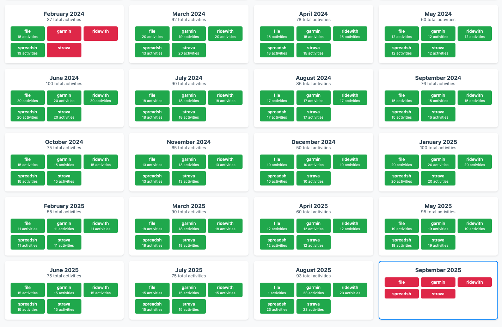

# tracekit

tracekit is a Python toolkit for aggregating, syncing, and analyzing fitness activity data from multiple sources (Strava, RideWithGPS, Garmin, spreadsheets, and local files). It is designed to be self-contained, non-destructive, and extensible.

🌐 **Website**: [tracekit.app](https://tracekit.app)
📚 **Source**: [github.com/ckdake/tracekit](https://github.com/ckdake/tracekit)

> ⚠️ **Caution:** This is under active development. Do not use it without reading every line of code.

[](https://github.com/ckdake/tracekit/actions/workflows/ruff.yml)
[](https://github.com/ckdake/tracekit/actions/workflows/pytest.yml)
[](https://github.com/ckdake/tracekit/actions/workflows/mypy.yml)
[](https://github.com/ckdake/tracekit/actions/workflows/deploy-site.yml)



---

## Running Locally

> ⚠️ **Work in Progress.** Local setup works but is not yet polished. Expect rough edges.

### Option 1: Development Container (Recommended)

1. Install [VS Code](https://code.visualstudio.com/) and [Docker](https://www.docker.com/)
2. Clone the repo and open it in VS Code
3. When prompted, click "Reopen in Container" (or `Ctrl+Shift+P` → "Dev Containers: Reopen in Container")
4. The container installs all dependencies and runs verification tests automatically

```bash
.devcontainer/verify.sh   # Verify the environment
python -m tracekit --help
```

### Option 2: Local Installation

```bash
git clone https://github.com/ckdake/tracekit.git
cd tracekit
pip install -e .[dev]
pre-commit install
```

### Environment Variables

Create a `.env` file in the project root:

```sh
# Strava (https://www.strava.com/settings/api)
STRAVA_CLIENT_ID=your_client_id
STRAVA_CLIENT_SECRET=your_client_secret
STRAVA_ACCESS_TOKEN=your_access_token
STRAVA_REFRESH_TOKEN=your_refresh_token
STRAVA_TOKEN_EXPIRES=token_expiration_timestamp

# RideWithGPS (https://ridewithgps.com/api)
RIDEWITHGPS_EMAIL=your_email
RIDEWITHGPS_PASSWORD=your_password
RIDEWITHGPS_KEY=your_api_key

# Garmin Connect
GARMIN_EMAIL=your_email
GARMINTOKENS=~/.garminconnect
```

### Authenticating with Strava

```bash
export STRAVA_CLIENT_ID=your_client_id
export STRAVA_CLIENT_SECRET=your_client_secret
python -m tracekit auth-strava
# Follow the OAuth prompts, then set STRAVA_ACCESS_TOKEN in your .env
```

### Authenticating with Garmin Connect

```bash
python -m tracekit auth-garmin
# Prompts for email/password, handles MFA, and stores OAuth tokens (~/.garminconnect)
# Tokens are valid for ~1 year and reused automatically
```

### Running

```bash
python -m tracekit --help
python -m tracekit configure   # interactive wizard — writes tracekit_config.json (seeds DB on first boot)
python -m tracekit pull --date 2025-08
python -m tracekit sync-month 2025-08
python -m tracekit reset --date 2025-08
```

> **Web dashboard:** For Docker deployments, configuration is stored in PostgreSQL and managed through the Settings UI at `/settings`. `tracekit_config.json` is only used as a one-time seed if present when the DB is empty.

---

## More

- [DEVELOPMENT.md](DEVELOPMENT.md) – Repo structure, dev tools, lint/test/package/release, VS Code integration
- [PRODUCTION.md](PRODUCTION.md) – Self-hosting with Docker and SSL termination
- [WEBSITE.md](WEBSITE.md) – Website development and deployment
- [TODO.md](TODO.md) – Planned work and known gaps
- [SECURITY.md](SECURITY.md) – Reporting security issues

---

## License

This project is licensed under the [Creative Commons Attribution-NonCommercial 4.0 International (CC BY-NC 4.0)](LICENSE.txt).
